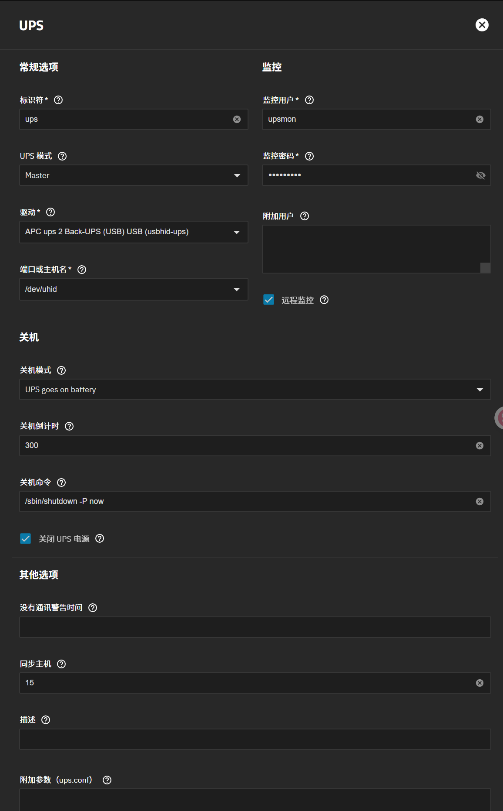

# 服务端

# 客户端

1. `apt install nut-client`
2. `vim /etc/nut/nut.conf`
    - 修改为 `MODE=netclient`
3. `vim /etc/nut/upsmon.conf`
    - 添加`MONITOR ups@10.10.10.200 1 username password slave`
4. `systemctl start nut-client`
5. `systemctl enable nut-client`
6. `systemctl status nut-client`
7. 服务端模拟断电
    - `upsmon -c fsd`